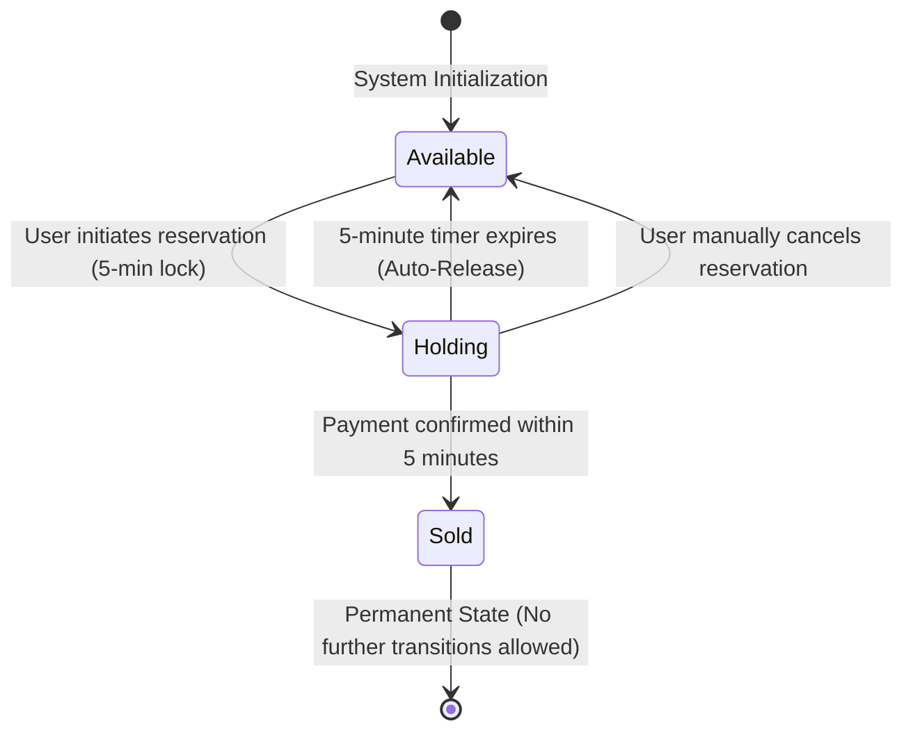

# Product Specification: Concert Ticket Booking System

This document provides the comprehensive product specification for the High-Concurrency Concert Ticket Booking System. It defines the user stories, acceptance criteria, business rules, edge cases, error scenarios, and validation rules governing the application.

This specification focuses entirely on the **functional behavior and constraints** of the system, without prescribing specific technical architectures, database schemas, or implementation details.

---

## 1. Product Decisions & Scope Clarification

To resolve the open questions identified in the project requirements and establish a concrete functional baseline, the following product decisions have been made:

1. **Ticket Categories & Pricing**:
   - The total inventory of **500 tickets** is divided into two categories:
     - **VIP Ticket**: 100 tickets priced at **$100** each.
     - **Standard Ticket**: 400 tickets priced at **$50** each.
2. **Purchase Limits**:
   - To prevent scalping, hoarding, and ensure a fair distribution, a strict limit of **1 ticket per user session** is enforced. A user session can only have one active hold or one completed purchase.
3. **Admin Dashboard Security**:
   - The Admin Dashboard is located at a dedicated route (`/admin`) and is protected by a simple, configurable passcode/token to prevent unauthorized public access while maintaining ease of testing.
4. **Countdown Expiry Behavior**:
   - Upon expiration of the 5-minute hold on the booking page:
     - The checkout form is immediately disabled.
     - An overlay modal appears stating: _"Your reservation has expired, and your ticket has been released back to the pool."_
     - The user is provided with a single call-to-action button: _"Return to Home Page"_.
     - The backend must reject any payment requests for expired holds.
5. **Data Persistence**:
   - The system must maintain persistent state. In the event of a server crash or restart, all ticket statuses (including active holds with their correct remaining durations and completed purchases) must be preserved.

---

## 2. User Stories & Acceptance Criteria

### US-1: Real-time Ticket Availability (Home Page)

**As a** Ticket Buyer  
**I want to** view the number of remaining tickets for each category in real-time on the Event Home Page  
**So that** I can see if tickets are still available before initiating a booking.

#### Acceptance Criteria:

- **AC 1.1**: The Event Home Page must display the two ticket categories: `VIP` and `Standard`, along with their respective prices ($100 and $50).
- **AC 1.2**: The page must display the remaining count of available tickets for each category (starting at 100 for VIP and 400 for Standard).
- **AC 1.3**: The remaining ticket counts must update in real-time (within 2 seconds) as other users hold or purchase tickets, without requiring the user to refresh the page.
- **AC 1.4**: If a category's available inventory reaches 0, the "Reserve" button for that category must be disabled and display "Sold Out".
- **AC 1.5**: If the total inventory (500 tickets) is sold out, a prominent "Sold Out" banner must be displayed on the home page.

---

### US-2: Select Ticket & Initiate Reservation

**As a** Ticket Buyer  
**I want to** select a ticket category and click "Reserve"  
**So that** the system temporarily locks a ticket for me and prevents anyone else from booking it.

#### Acceptance Criteria:

- **AC 2.1**: Clicking "Reserve" on an available ticket category must initiate a temporary hold on 1 ticket of that category.
- **AC 2.2**: Upon successful hold creation, the user must be redirected to the Booking/Checkout Page.
- **AC 2.3**: If the reservation is successful, the available inventory count for that category must immediately decrease by 1.
- **AC 2.4**: The system must prevent a user session from initiating a reservation if they already have an active hold or a completed purchase.
- **AC 2.5**: If multiple users attempt to reserve the last remaining ticket simultaneously, only one user can succeed; the others must receive a notification that the ticket is no longer available and remain on the home page.

---

### US-3: Hold Countdown Timer (Booking Page)

**As a** Ticket Buyer  
**I want to** see a visible 5-minute countdown timer on the Booking Page  
**So that** I know exactly how much time I have left to complete my payment.

#### Acceptance Criteria:

- **AC 3.1**: The Booking Page must display a countdown timer initialized to **5 minutes (05:00)** upon page load.
- **AC 3.2**: The countdown timer must tick down second-by-second in `MM:SS` format.
- **AC 3.3**: The timer must be synchronized with the server's lock expiration time. A page refresh must not reset the timer to 5 minutes; it must resume from the remaining duration calculated by the server.
- **AC 3.4**: When the timer reaches `00:00`, the checkout form must immediately disable (input fields read-only, buttons disabled) and show an expiration modal.
- **AC 3.5**: The expiration modal must contain a button that redirects the user back to the Event Home Page.

---

### US-4: Simulated Payment Checkout

**As a** Ticket Buyer  
**I want to** submit my payment details and complete the purchase within the 5-minute window  
**So that** I can secure my ticket permanently.

#### Acceptance Criteria:

- **AC 4.1**: The Booking Page must present a simple checkout form (e.g., Name, Email, and Card Number) and a "Pay Now" button.
- **AC 4.2**: Clicking "Pay Now" must submit the payment request and display a clear loading spinner, disabling the button to prevent double-submits.
- **AC 4.3**: The payment process is simulated. The UI should allow testing both successful and failed payment scenarios (e.g., via a toggle or mock inputs).
- **AC 4.4**: Upon successful payment confirmation, the user must be redirected to a **Confirmation Page** displaying a success message, the ticket type, a unique Ticket Reference Code, and purchase details.
- **AC 4.5**: Upon successful payment, the ticket's state must permanently transition to `Sold` on the server.
- **AC 4.6**: If the payment fails, the user must remain on the Booking Page, an error message must be displayed, and the "Pay Now" button must be re-enabled to allow another attempt, provided the 5-minute timer has not expired.

---

### US-5: Automatic Release of Expired Holds

**As a** Ticket Buyer / Concert Organizer  
**I want** the system to automatically release a held ticket if the 5-minute window expires without payment  
**So that** the ticket is immediately made available for other buyers.

#### Acceptance Criteria:

- **AC 5.1**: If a ticket remains in the `Holding` state for more than 5 minutes (300 seconds) from its reservation timestamp, the server must automatically transition it back to `Available`.
- **AC 5.2**: The released ticket must immediately be added back to the available inventory count, and this update must be pushed to all active users on the Event Home Page in real-time.
- **AC 5.3**: If a user attempts to pay for a ticket whose hold has expired, the server must reject the payment, and the user must be notified that the transaction could not be completed.

---

### US-6: Sales and Revenue Analytics (Admin Dashboard)

**As a** Concert Organizer  
**I want to** view real-time sales metrics on a secure Admin Dashboard  
**So that** I can monitor the financial performance and inventory status of the event.

#### Acceptance Criteria:

- **AC 6.1**: The Admin Dashboard must be accessible only via the `/admin` route.
- **AC 6.2**: The dashboard must prompt for an access passcode before displaying any data.
- **AC 6.3**: The dashboard must display the following metrics in real-time:
  - **Total Tickets Sold**: Cumulative count of tickets in the `Sold` state.
  - **Total Revenue**: The sum of prices of all sold tickets (e.g., `(VIP Sold * 100) + (Standard Sold * 50)`).
  - **Remaining Inventory**: Breakdown of remaining `VIP` and `Standard` tickets.
- **AC 6.4**: The dashboard must display a **Live Lock Monitor** containing a table of all tickets currently in the `Holding` state.
- **AC 6.5**: The Live Lock Monitor table must include:
  - Ticket ID / Serial Number.
  - Ticket Category (VIP / Standard).
  - Session Identifier holding the ticket.
  - Remaining Hold Time (countdown in minutes and seconds).

---

## 3. Business Rules (BR)

### BR-1: Inventory Integrity & Overselling Prevention

- The system has a hard ceiling of **500 total tickets** (100 VIP, 400 Standard).
- Under no circumstances can the number of tickets in the `Sold` state exceed these limits.
- Inventory updates must be atomic. The system must prevent race conditions where concurrent requests attempt to reserve or buy the same ticket.

### BR-2: Purchase and Session Limits

- **Active Hold Limit**: A single user session (identified by a unique session token) can hold at most **1 ticket** at any time.
- **Completed Purchase Limit**: A single user session can purchase at most **1 ticket** in total. If a session has a ticket in the `Sold` state, it cannot reserve or purchase another ticket.
- **Session Association**: A ticket hold is strictly bound to the session token that created it. Only the session that created the hold can complete the payment for that ticket.

### BR-3: Ticket State Machine

A ticket must strictly adhere to the following lifecycle states and transitions:

- **Valid Transitions**:
  - `Available` $\rightarrow$ `Holding`
  - `Holding` $\rightarrow$ `Sold`
  - `Holding` $\rightarrow$ `Available`
- **Invalid Transitions**:
  - `Available` $\rightarrow$ `Sold` (Tickets must be held first to ensure fairness and prevent cart-jumping)
  - `Sold` $\rightarrow$ `Available` or `Holding` (Once sold, tickets cannot be returned to the pool or re-held)

### BR-4: The 5-Minute Reservation Window

- The hold duration is exactly **300 seconds (5 minutes)**.
- The countdown begins the moment the server successfully records the ticket state change from `Available` to `Holding`.
- The expiration time is calculated on the server using a server-side timestamp (`expiration_time = reservation_time + 300 seconds`).
- Client-side clocks must not be trusted to determine expiration.

### BR-5: Active Release Mechanism

- The system cannot rely on "lazy" expiration (i.e., checking if a hold is expired only when another user tries to book it).
- An active background process or event-driven TTL mechanism must reclaim expired holds immediately upon expiration to ensure the real-time availability count remains accurate.

---

## 4. Validation Rules (VR)

### VR-1: Reservation Request Validation

When a user requests to reserve a ticket, the backend must validate:

1. **Session Token**: Must be present, non-empty, and conform to the session format (e.g., UUIDv4).
2. **Ticket Type**: Must be present and match one of the allowed categories: `VIP` or `Standard`.
3. **Session State**:
   - The session must not currently associate with any ticket in the `Holding` state.
   - The session must not currently associate with any ticket in the `Sold` state.
4. **Inventory Availability**: There must be at least 1 ticket of the requested type in the `Available` state.

### VR-2: Payment Request Validation

When a user submits payment, the backend must validate:

1. **Session Token**: Must be present and match the session associated with the ticket hold.
2. **Ticket ID**: Must be present and match a ticket currently in the `Holding` state.
3. **Expiration**: The current server time must be less than or equal to the ticket's recorded `expiration_time`.
4. **Payment Details**: Basic format validation for checkout fields (e.g., email format, non-empty name, card number length).

### VR-3: Admin Access Validation

When accessing the Admin Dashboard or its APIs:

1. **Passcode**: The request must include an authorization header or cookie containing the correct passcode.
2. Malformed or incorrect passcodes must be rejected immediately with an authentication error.

---

## 5. Edge Cases & Mitigation (EC)

| Edge Case                                    | Scenario                                                                                                                                                                                             | Product Mitigation                                                                                                                                                                                                                                                                                                                                                                                                                                                                 |
| :------------------------------------------- | :--------------------------------------------------------------------------------------------------------------------------------------------------------------------------------------------------- | :--------------------------------------------------------------------------------------------------------------------------------------------------------------------------------------------------------------------------------------------------------------------------------------------------------------------------------------------------------------------------------------------------------------------------------------------------------------------------------- |
| **EC-1: Last-Second Payment**                | A user clicks "Pay Now" at `04:59` (remaining hold: 1 second). The network transit and payment processing take 2 seconds, completing at `05:01`.                                                     | **Absolute Server Timestamp**: The server evaluates the hold at the exact millisecond the payment request is received. If the ticket has already been released (even if it hasn't been reserved by someone else yet), the payment is rejected. _Alternative/Optimization:_ The server can temporarily transition the ticket to a short-lived `Paying` state (max 15 seconds) when the checkout form is submitted, preventing the background job from releasing it mid-transaction. |
| **EC-2: Concurrent Reservation Spikes**      | Only 1 `VIP` ticket remains. 100 users click "Reserve" at the exact same millisecond.                                                                                                                | **Atomic Locking**: The backend must process reservation requests sequentially or using atomic database operations. Only one request will successfully transition the ticket to `Holding`. The remaining 99 requests must immediately receive a "Sold Out" response and remain on the home page.                                                                                                                                                                                   |
| **EC-3: Network Disconnection / Tab Closed** | A user successfully reserves a ticket but immediately closes their browser, loses internet connection, or navigates away.                                                                            | **Automatic Cleanup**: The ticket remains in `Holding` for the remainder of the 5 minutes. The active release mechanism will automatically return the ticket to `Available` once the timer expires. The user's session remains blocked from reserving another ticket until the current hold expires.                                                                                                                                                                               |
| **EC-4: Double-Clicking Payment**            | An anxious user clicks the "Pay Now" button multiple times in rapid succession.                                                                                                                      | **Frontend Disabling & Backend Idempotency**: The frontend must disable the "Pay Now" button immediately upon the first click. The backend payment endpoint must be idempotent; if it receives duplicate payment requests for the same ticket/session within a short window, it must ignore subsequent requests or return the result of the first.                                                                                                                                 |
| **EC-5: Post-Expiration Payment Success**    | A payment gateway simulation succeeds, but due to network delays, the server receives the success notification after the 5-minute hold has expired and the ticket has been reserved by another user. | **Rejection & Reverse Transaction**: The server must reject the payment confirmation since the ticket is no longer held by that session. A simulated refund/reversal process must be triggered, and the user must be shown a "Transaction Expired" error.                                                                                                                                                                                                                          |

---

## 6. Error Scenarios & UX Handling (ES)

Under error conditions, the system must degrade gracefully, providing clear, actionable feedback to the user while protecting the integrity of the system.

### ES-1: Ticket Category Sold Out

- **Trigger**: A user attempts to reserve a ticket, but all tickets in that category are already `Holding` or `Sold`.
- **System Response**:
  - **API**: Returns `409 Conflict` with error code `TICKET_UNAVAILABLE`.
  - **UX**: Displays an inline notification on the Home Page: _"Sorry, all tickets in this category are currently reserved or sold. Please check back soon as some reservations may expire."_ The "Reserve" button for that category updates to "Sold Out" or "Unavailable".

### ES-2: Active Hold Exceeded

- **Trigger**: A user attempts to bypass the UI and reserve a second ticket while their session already has an active hold.
- **System Response**:
  - **API**: Returns `400 Bad Request` with error code `ACTIVE_HOLD_EXISTS`.
  - **UX**: Redirects the user back to their active booking page with a message: _"You already have an active reservation. Please complete your purchase or wait for it to expire."_

### ES-3: Purchase Limit Exceeded

- **Trigger**: A user attempts to reserve another ticket after successfully purchasing one.
- **System Response**:
  - **API**: Returns `400 Bad Request` with error code `PURCHASE_LIMIT_EXCEEDED`.
  - **UX**: Redirects the user to their original confirmation page or displays a message: _"You have already purchased a ticket. There is a limit of 1 ticket per customer."_

### ES-4: Hold Expired During Checkout

- **Trigger**: The user is on the checkout page, fills out the form, but the countdown reaches `00:00` before they click pay, or they click pay after the server has already released the hold.
- **System Response**:
  - **API**: Returns `410 Gone` with error code `RESERVATION_EXPIRED`.
  - **UX**: Disables the checkout form, displays an overlay modal: _"Your 5-minute reservation window has expired. The ticket has been released back to the general inventory."_, and provides a button to return to the Home Page.

### ES-5: Payment Failure

- **Trigger**: The simulated payment fails (e.g., due to simulated insufficient funds or invalid card details).
- **System Response**:
  - **API**: Returns `402 Payment Required` with error code `PAYMENT_FAILED`.
  - **UX**: Displays a red error banner on the checkout page: _"Payment failed: [Reason]. Please verify your details and try again."_ The countdown timer continues to tick down, and the "Pay Now" button is re-enabled.

### ES-6: High-Concurrency Rate Limiting / Server Busy

- **Trigger**: The system experiences a massive spike in requests exceeding the capacity of the API gateway or database connection pool.
- **System Response**:
  - **API**: Returns `429 Too Many Requests` or `503 Service Unavailable`.
  - **UX**: Displays a friendly overlay: _"The booking line is busy. We are processing your request, please wait..."_ or _"Server is currently busy. Please click the button to try again."_ without losing the user's position in the queue if possible.
