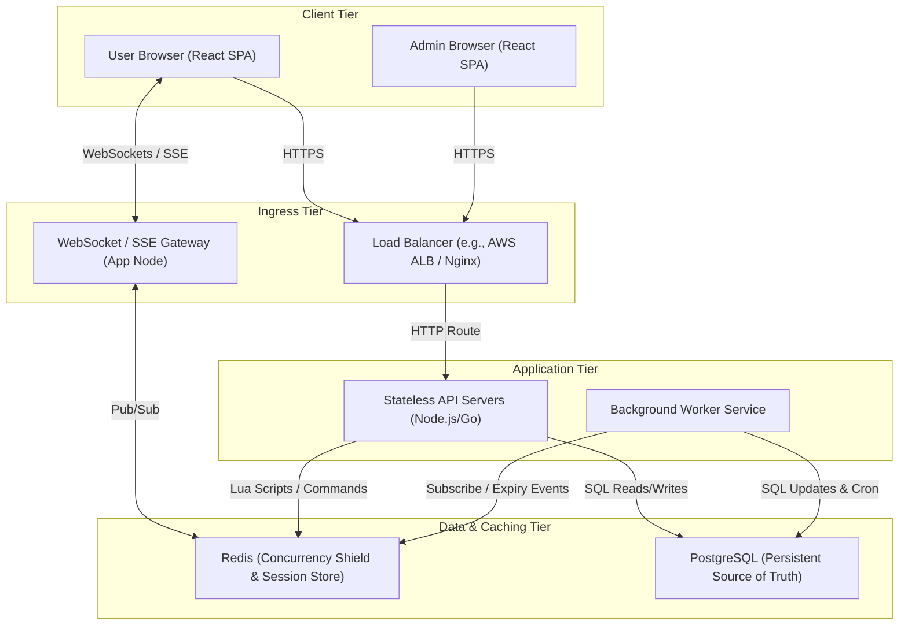
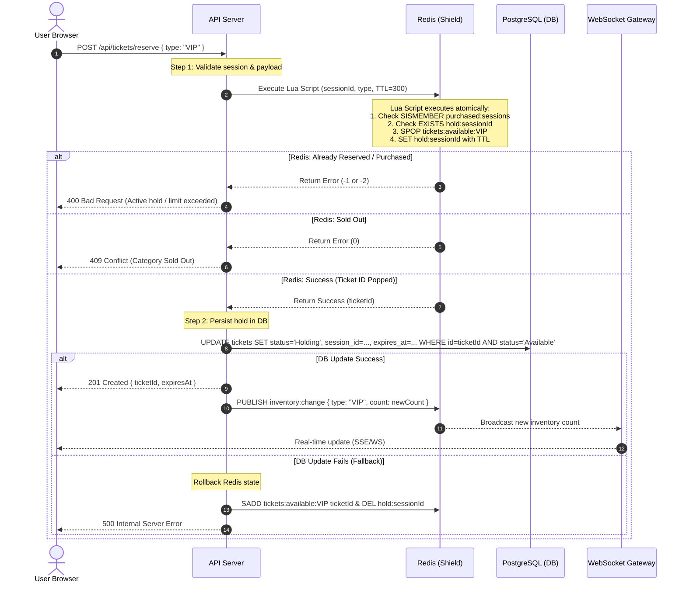
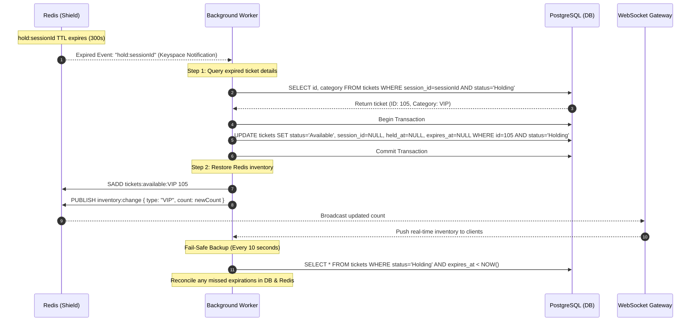
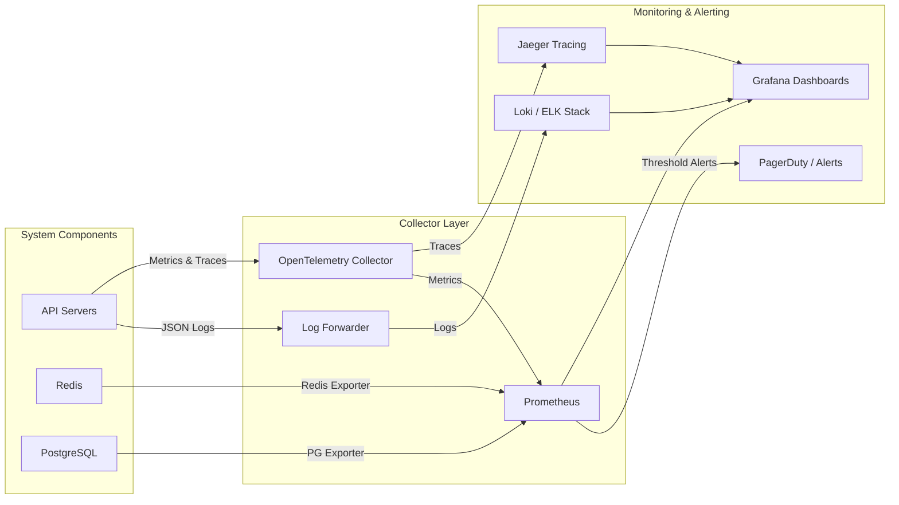

# System Architecture: High-Concurrency Ticket Booking System

This document outlines the production-ready system architecture for the Concert Ticket Booking System. The architecture is designed to handle high-concurrency write spikes (5,000 concurrent users at the moment of opening) for a limited inventory of 500 tickets (100 VIP, 400 Standard), ensuring zero overselling, strict purchase limits, and real-time responsiveness.

---

## 1. High-Level Architecture

The system uses a **layered, event-driven architecture** featuring a **"Concurrency Shield"** pattern. To protect the relational database from high lock contention and bottlenecking during the peak traffic spike, an in-memory caching and coordination layer (Redis) acts as the primary gatekeeper for inventory and session state.

### 1.1. System Container Diagram



---

## 2. Component Breakdown & Responsibilities

The system is divided into four distinct tiers:

### 2.1. Presentation Tier

- **Client Application (React SPA)**:
  - Renders a lightweight, optimized interface.
  - Implements frontend-side UX controls: button disabling, optimistic UI state, and countdown synchronization with server-provided timestamps.
  - Establishes a persistent WebSocket or Server-Sent Events (SSE) connection to receive real-time inventory counts and state updates.

### 2.2. Ingress & Routing Tier

- **Load Balancer (ALB / Nginx)**:
  - Distributes incoming HTTP and WebSocket connections across the pool of stateless API servers.
  - Handles SSL/TLS termination.
  - Enforces rate limiting at the IP level to block malicious bot traffic and DDoS attempts.

### 2.3. Application Tier

- **Stateless API Servers**:
  - Serve REST/GraphQL endpoints for ticket booking, payment simulation, and admin operations.
  - Conduct strict input validation (VR-1, VR-2).
  - Execute atomic inventory operations against Redis using Lua scripting.
  - Commit successful transactions to the PostgreSQL database.
- **Background Worker Service**:
  - Listens to Redis keyspace notification events (specifically key expirations).
  - Executes a scheduled cleanup job (cron) every 10 seconds to reconcile expired holds in PostgreSQL that might have been missed due to network partition.
  - Broadcasts inventory state updates to the WebSocket/SSE gateway.

### 2.4. Data & Caching Tier (The Concurrency Shield)

- **Redis (In-Memory Concurrency Shield)**:
  - **Hot Inventory Store**: Maintains sets of available ticket IDs (`tickets:available:VIP`, `tickets:available:Standard`).
  - **Session Lock Store**: Stores temporary holds as keys with a Time-To-Live (TTL) of 300 seconds (`hold:{sessionId}` -> `ticketId:ticketType`).
  - **Purchase Registry**: Stores a set of sessions that have successfully purchased tickets (`purchased:sessions`) to enforce the 1-ticket-per-user limit.
  - **Pub/Sub**: Facilitates real-time message broadcasting across API nodes.
- **PostgreSQL (Persistent Storage)**:
  - Serves as the system's durable source of truth.
  - Stores the relational schema: `tickets` (ID, Category, Price, Status, Session ID, Held At, Expires At), `orders/transactions` (ID, Ticket ID, Session ID, Amount, Status, Paid At), and `admin_configs`.
  - Configured with appropriate indexes on `status`, `session_id`, and `expires_at` to ensure sub-millisecond query execution.

---

## 3. Data Flow Diagrams

### 3.1. Ticket Reservation Flow (The Redis Shield)

When a user clicks "Reserve", the request is routed to an API Server. The server executes a Redis Lua script to check eligibility and claim the ticket in memory before touching the database. This shields PostgreSQL from the 5,000 concurrent request spike.



### 3.2. Payment & Confirmation Flow

This flow permanently transitions a held ticket to the `Sold` state. Only the session holding the ticket can execute this flow, and it must occur before the 5-minute expiration.

```mermaid
sequenceDiagram
    autonumber
    actor User as User Browser
    participant API as API Server
    participant Redis as Redis (Shield)
    participant DB as PostgreSQL (DB)
    participant WS as WebSocket Gateway

    User->>API: POST /api/payments/checkout { ticketId, paymentDetails }
    Note over API: Step 1: Validate input & session

    API->>DB: Begin Transaction
    API->>DB: SELECT * FROM tickets WHERE id=ticketId FOR UPDATE

    alt Ticket not in 'Holding' OR session mismatch OR expired
        API->>DB: Rollback
        API-->>User: 410 Gone / 400 Bad Request (Reservation Expired)
    else Ticket Hold is Valid
        Note over API: Step 2: Process Simulated Payment
        API->>API: Simulate payment gateway authorization

        alt Payment Successful
            API->>DB: UPDATE tickets SET status='Sold' WHERE id=ticketId
            API->>DB: INSERT INTO orders (ticket_id, session_id, price, status) VALUES (...)
            API->>DB: Commit Transaction

            Note over API: Step 3: Update Concurrency Shield
            API->>Redis: DEL hold:sessionId
            API->>Redis: SADD purchased:sessions sessionId

            API-->>User: 200 OK { confirmationCode, ticketDetails }
            API->>Redis: PUBLISH inventory:change { type: "VIP", sold: true }
            Redis-->>WS: Broadcast updated sold/revenue metrics
        else Payment Failed
            API->>DB: Rollback
            API-->>User: 402 Payment Required (Payment Failed)
            Note over User: User remains on Booking Page;<br/>Timer continues ticking.
        end
    end
```

### 3.3. Hold Expiration & Auto-Release Flow

To keep inventory accurate, expired holds are released through a primary event-driven mechanism backed by a secondary polling cron job.



---

## 4. Deployment Architecture

The application is deployed on a highly available, containerized cloud infrastructure (e.g., AWS or GCP) spread across multiple Availability Zones (AZs) to ensure resilience.

```
                                  [ Internet ]
                                       │
                                ┌──────▼──────┐
                                │ Cloudflare  │ (CDN & WAF)
                                └──────┬──────┘
                                       │ (HTTPS)
                            ┌──────────▼──────────┐
                            │ Ingress ALB / Nginx │
                            └──────────┬──────────┘
                                       │
            ┌──────────────────────────┼──────────────────────────┐
            │ Multi-AZ Private Subnet  │                          │
            ▼                          ▼                          ▼
   ┌─────────────────┐        ┌─────────────────┐        ┌─────────────────┐
   │   AZ-A (Active) │        │   AZ-B (Active) │        │  AZ-C (Passive) │
   │                 │        │                 │        │                 │
   │  ┌───────────┐  │        │  ┌───────────┐  │        │                 │
   │  │ API Node  │  │        │  │ API Node  │  │        │                 │
   │  └─────┬─────┘  │        │  └─────┬─────┘  │        │                 │
   │        │        │        │        │        │        │                 │
   │  ┌─────▼─────┐  │        │  ┌─────▼─────┐  │        │                 │
   │  │Redis Prim.│  │◄───────┼──│Redis Repl.│  │        │                 │
   │  └─────┬─────┘  │(Replic)│  └─────┬─────┘  │        │                 │
   │        │        │        │        │        │        │                 │
   │  ┌─────▼─────┐  │        │  ┌─────▼─────┐  │        │  ┌───────────┐  │
   │  │ PostgreSQL│  │◄───────┼──│ PostgreSQL│  │◄───────┼──│ PostgreSQL│  │
   │  │ (Primary) │  │(Replic)│  │ (Replica) │  │(Replic)│  │(Read-Repl)│  │
   │  └───────────┘  │        │  └───────────┘  │        │  └───────────┘  │
   └─────────────────┘        └─────────────────┘        └─────────────────┘
```

### 4.1. Infrastructure Component Configuration

- **CDN & WAF (Cloudflare)**: Caches static assets (HTML, CSS, JS) at edge locations, shielding the application servers from F5 refresh spikes. Restricts access by filtering bot patterns and rate-limiting IPs.
- **API Nodes (Amazon ECS / EKS)**: Run stateless containers. Auto-scaling is configured based on CPU utilization and request count.
- **Redis Deployment**:
  - Deployed in a **Primary-Replica** configuration with Redis Sentinel for automatic failover.
  - Persistence configured with **AOF (Append Only File)** set to `everysec` to guarantee data durability without degrading write performance.
- **PostgreSQL Deployment**:
  - Deployed as a Managed DB Instance (e.g., AWS RDS) with Multi-AZ enabled for synchronous replication and automatic failover.
  - Read-replicas can be spun up in passive zones to offload read-heavy reporting queries from the Admin Dashboard.

---

## 5. Scalability & High-Concurrency Strategy

To successfully support 5,000 concurrent users booking 500 tickets, the following scalability strategies are implemented:

### 5.1. Database Protection & Connection Pooling

- **No Direct DB Hit on Check**: During the initial rush, 90% of user requests will result in "Sold Out" or "Active Hold Exists". By resolving these checks entirely in Redis, the PostgreSQL database is insulated from load.
- **Connection Pooler (PgBouncer)**: Deployed in front of PostgreSQL. It prevents connection exhaustion on the database by managing a pool of warm, reusable database connections, keeping the DB overhead low.

### 5.2. Redis Lua Script Atomicity

- Redis executes Lua scripts in a single-threaded execution context. This guarantees that the check-and-reserve operation is **100% atomic**. No two requests can reserve the same ticket, completely eliminating the risk of overselling.

### 5.3. WebSocket/SSE Scaling

- **Pub/Sub Backplane**: Since clients maintain open WebSocket/SSE connections to receive real-time inventory updates, connection state is distributed across multiple API nodes.
- When inventory changes, the API server publishes the event to Redis Pub/Sub. All active API nodes subscribe to this channel and broadcast the update to their locally connected clients, keeping system memory footprint low.

---

## 6. Security Architecture

### 6.1. Anti-Scalping & Bot Prevention

- **Cryptographic Session Tokens**: Upon landing on the home page, the client is issued a secure, signed JWT session token containing a unique session ID. This token is stored in an `HttpOnly`, `Secure`, `SameSite=Strict` cookie.
- **Strict Session Association**: The backend validates that the session ID in the reservation request matches the session ID in the payment request. Users cannot pay for a ticket held by another session.
- **Rate Limiting**: IP-based rate limiting on the `/api/tickets/reserve` endpoint (e.g., maximum 3 requests per 10 seconds per session) to prevent automated script spamming.

### 6.2. Admin Dashboard Security

- **Passcode Protection**: The `/admin` path and all `/api/admin/*` endpoints require authentication. The admin client must send an `Authorization: Bearer <Admin_Token>` header.
- **Token Rotation**: The admin token is stored in secure environment variables and verified using HMAC-SHA256.
- **IP Whitelisting**: Optionally, the ingress controller can restrict access to the `/admin` path to specific corporate IP ranges or VPNs.

---

## 7. Observability & Monitoring

A comprehensive observability stack ensures visibility into system health, allowing operators to detect and resolve bottlenecks immediately.



### 7.1. Key Metrics to Monitor

1. **Business Metrics**:
   - Ticket Status Count (`available`, `holding`, `sold` per category).
   - Total Revenue Generated.
   - Rate of reservation expirations (indicates cart abandonment or payment issues).
2. **Performance Metrics**:
   - API Latency (p50, p95, p99) for `/reserve` and `/checkout` (Target: < 200ms).
   - Active WebSocket/SSE connection counts.
3. **Infrastructure Metrics**:
   - Redis CPU and Memory usage (critical for in-memory operations).
   - PostgreSQL active connections and lock wait times.
   - API Server container CPU/Memory utilization.

### 7.2. Logging & Tracing

- **Structured Logging**: All logs are emitted in JSON format with fields like `timestamp`, `level`, `session_id`, `ticket_id`, `path`, and `error_code`.
- **Distributed Tracing**: OpenTelemetry is used to trace requests across the API Gateway, API Server, Redis, and PostgreSQL. A unique `trace_id` is propagated from the client, allowing end-to-end debugging of transaction failures.
- **Alerting Thresholds**: Alerts are configured to trigger if:
  - API error rates (`5xx`) exceed 1% over a 1-minute window.
  - Redis memory usage exceeds 75% of capacity.
  - Database CPU utilization exceeds 80%.
  - The number of tickets in the `Holding` state exceeds 500 (indicates a state-machine leak).
