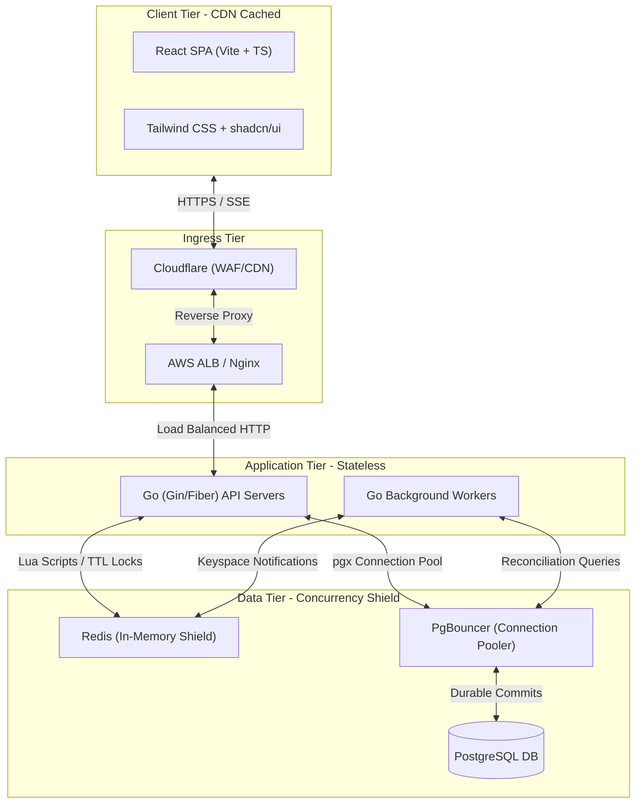

# Technology Stack Recommendation: High-Concurrency Ticket Booking System

This document outlines the recommended technology stack for the High-Concurrency Concert Ticket Booking System. It provides a detailed analysis of the components, compares viable alternatives, explains the architectural trade-offs, and justifies how the selected stack fulfills the functional and non-functional requirements (such as zero overselling, 5-minute holds, and 5,000 concurrent users).

---

## 1. Executive Summary: The Recommended Stack

To support a sudden traffic spike of **5,000 concurrent users** competing for a limited pool of **500 tickets**, the technology stack must prioritize **low latency, atomic concurrency control, and high throughput**.

Here is the recommended production-ready technology stack:

| Layer                        | Recommended Technology                               | Primary Reason for Selection                                                                                      |
| :--------------------------- | :--------------------------------------------------- | :---------------------------------------------------------------------------------------------------------------- |
| **Frontend Framework**       | **Vite + React (TypeScript)**                        | Extremely lightweight, fast build times, easily cached on CDN edges to shield servers from F5 refresh spikes.     |
| **Frontend Styling & UI**    | **Tailwind CSS + shadcn/ui**                         | Rapid UI development with clean, highly accessible, and customizable interactive components.                      |
| **Backend Language/Runtime** | **Go (Golang)** _(Alternative: Node.js + Fastify)_   | Exceptional concurrency performance via goroutines, minimal memory footprint, and rapid execution speed.          |
| **Backend Web Framework**    | **Gin / Fiber** _(Go)_ or **Fastify** _(Node.js)_    | High-throughput, low-overhead routing engines designed for high-performance APIs.                                 |
| **Database Client / ORM**    | **sqlc + pgx** _(Go)_ or **Drizzle ORM** _(Node.js)_ | Type-safe, raw-performance database access with zero query engine overhead, avoiding ORM bottlenecks.             |
| **In-Memory Caching & Lock** | **Redis (ElastiCache)**                              | Key-value store supporting atomic Lua scripting for the Concurrency Shield and automatic TTL-based hold releases. |
| **Primary Database**         | **PostgreSQL (RDS)**                                 | Enterprise-grade ACID compliance, robust transactional integrity, and excellent indexing capabilities.            |
| **Real-time Push**           | **Server-Sent Events (SSE)**                         | Lightweight, unidirectional HTTP-based push. Highly efficient for broadcasting inventory counts.                  |
| **Load Testing**             | **k6 (Grafana)**                                     | Scriptable in JavaScript, highly resource-efficient, capable of simulating thousands of concurrent virtual users. |

---

## 2. Tier-by-Tier Architecture & Recommendations

### 2.1. Frontend Tier: Vite + React + TypeScript

For a high-concurrency booking system, the frontend must remain highly responsive and avoid freezing during network latency.

- **Vite**: Replaces traditional Webpack. It provides instantaneous Hot Module Replacement (HMR) during development and builds highly optimized, chunked static assets.
- **React**: A component-based library that excels at managing complex interactive states, such as synchronized countdown timers, loading spinners, and real-time list updates.
- **TypeScript**: Enforces static typing, reducing runtime errors and improving developer productivity.
- **State Management & Data Fetching**:
  - **TanStack Query (React Query)**: Manages server state, caching, auto-retries, and loading/error states out-of-the-box.
  - **Axios**: A robust promise-based HTTP client for API communication.
  - **Native EventSource**: Handles the client-side connection for Server-Sent Events (SSE).

### 2.2. Backend Tier: Go (Golang)

The backend is the critical path. It must process 5,000 requests arriving at the exact same millisecond.

- **Go (Golang)**:
  - Compiles directly to machine code, resulting in near-instant startup times and minimal memory usage (~15-30MB per container).
  - Uses **goroutines** (lightweight threads managed by the Go runtime) which cost only 2KB of memory each, allowing a single server to handle tens of thousands of concurrent connections easily.
  - _Alternative (Node.js + TypeScript)_: If developer familiarity or codebase alignment requires a single-language stack, Node.js with **Fastify** and **TypeScript** is the recommended alternative. Fastify utilizes a highly optimized schema compiler and event-driven, non-blocking I/O to achieve outstanding throughput.
- **Web Framework**:
  - **Gin / Fiber (Go)**: Fiber is modeled after Express but built on top of `valyala/fasthttp` (the fastest HTTP engine for Go). Gin is highly mature, stable, and offers exceptional routing performance.
  - **Fastify (Node.js)**: Up to 2x faster than Express, with built-in JSON schema validation.
- **Database Client / ORM**:
  - **sqlc + pgx (Go)**: `sqlc` compiles raw SQL queries into fully type-safe Go code. It bypasses the overhead of traditional ORMs (like GORM), while `pgx` provides a high-performance, PostgreSQL-specific driver and connection pool.
  - **Drizzle ORM (Node.js)**: A lightweight, TypeScript-first ORM that compiles to raw SQL queries without a heavy runtime query engine, ensuring maximum performance.

### 2.3. Caching & Coordination Tier: Redis

Redis is the **Concurrency Shield** that protects the relational database from crashing.

- **Data Structures**:
  - **Sets (`tickets:available:{type}`)**: Stores available ticket IDs. Used with `SPOP` (atomic pop) to allocate tickets.
  - **Strings (`hold:{sessionId}`)**: Stores the ticket ID held by a session, configured with a `300-second` TTL.
  - **Sets (`purchased:sessions`)**: Stores sessions that have completed a purchase to enforce the 1-ticket limit.
- **Lua Scripting**: Allows executing multiple commands on the Redis server atomically. The entire check-and-reserve process is written in Lua, ensuring no race conditions can occur.
- **Keyspace Notifications**: Configured to emit events on key expirations (`EXPIRED`), triggering the background worker to release the ticket in PostgreSQL.

### 2.4. Database Tier: PostgreSQL

- **PostgreSQL**: Chosen for its robust ACID compliance. Ticketing involves financial transactions where data integrity is non-negotiable.
- **PgBouncer**: A lightweight connection pooler for PostgreSQL. When 5,000 users connect, the API servers will spin up many database clients. PgBouncer prevents the database from exhausting its backend connection limit by multiplexing active transactions over a small pool of warm connections.

### 2.5. Real-time Communication: Server-Sent Events (SSE)

- **SSE (Server-Sent Events)**:
  - A standard HTTP-based protocol (`text/event-stream`) that allows the server to push real-time updates to the client.
  - Unlike WebSockets, it is **unidirectional** (server-to-client). Since clients perform all actions (reserving, paying) via standard REST endpoints (`POST`), they only need to receive inventory updates.
  - Highly efficient, automatically handles reconnection, and operates over standard HTTP/2 without requiring custom protocol upgrades.

---

## 3. Technology Alternatives & Comparisons

Selecting the right technology requires evaluating viable alternatives. Below is an analysis of the options considered for each tier.

### 3.1. Backend Runtime: Go vs. Node.js vs. Python

| Criteria                       | Go (Golang) (Recommended)                              | Node.js (TypeScript) (Alternative)                              | Python (FastAPI)                                     |
| :----------------------------- | :----------------------------------------------------- | :-------------------------------------------------------------- | :--------------------------------------------------- |
| **Concurrency Model**          | Goroutines (CSP-based, multi-threaded scheduler)       | Single-threaded Event Loop (Asynchronous I/O)                   | Asyncio (Single-threaded event loop)                 |
| **Throughput (Requests/sec)**  | **Extremely High** ($\approx 80k+$)                    | **High** ($\approx 35k-45k$ with Fastify)                       | **Moderate** ($\approx 15k-20k$)                     |
| **Memory Footprint**           | **Very Low** ($\approx 15-30$ MB)                      | **Moderate** ($\approx 80-150$ MB)                              | **Moderate** ($\approx 70-120$ MB)                   |
| **Execution Speed**            | **Fast** (Compiled to binary)                          | **Medium** (JIT compiled)                                       | **Slow** (Interpreted)                               |
| **Developer Velocity**         | Moderate (Strict type system, explicit error handling) | **High** (Shared TS models with frontend, large npm ecosystem)  | **Very High** (Highly expressive, rapid prototyping) |
| **CPU-Bound Task Performance** | **Excellent** (Multi-core utilization)                 | **Poor** (Blocks the event loop unless worker threads are used) | **Poor** (Blocked by Global Interpreter Lock - GIL)  |

> [!TIP]
> **Recommendation**: Choose **Go** if raw performance, low operational costs, and absolute stability under extreme load are the top priorities. Choose **Node.js (TypeScript)** if rapid feature development, shared code/types between frontend and backend, and team familiarity with JavaScript are more critical.

---

### 3.2. Real-time Protocol: SSE vs. WebSockets vs. HTTP Polling

| Criteria                    | Server-Sent Events (SSE) (Recommended)                | WebSockets                                                      | HTTP Short/Long Polling                                          |
| :-------------------------- | :---------------------------------------------------- | :-------------------------------------------------------------- | :--------------------------------------------------------------- |
| **Direction**               | **Unidirectional** (Server $\rightarrow$ Client)      | **Bidirectional** (Server $\leftrightarrow$ Client)             | Unidirectional (Client $\rightarrow$ Server)                     |
| **Protocol**                | **HTTP/1.1 or HTTP/2**                                | Custom WS Protocol (requires handshake upgrade)                 | Standard HTTP                                                    |
| **Resource Usage**          | **Very Low** (Shares HTTP/2 connections, lightweight) | **Moderate** (Maintains persistent TCP socket per client)       | **Extremely High** (Spams the server with constant new requests) |
| **Reconnection**            | **Built-in** (Automatic client-side retry)            | Manual implementation required                                  | Native (new request)                                             |
| **Firewall/Proxy Friendly** | **Yes** (Standard HTTP traffic)                       | Sometimes blocked by strict enterprise firewalls/proxies        | Yes                                                              |
| **Complexity**              | **Very Low** (Simple text stream API)                 | **High** (Requires managing connection lifecycles on both ends) | Very Low                                                         |

> [!IMPORTANT]
> **Trade-off Decision**: While WebSockets are excellent for bidirectional communication (like chat apps), they introduce unnecessary complexity and connection overhead for ticketing. **SSE** provides a highly efficient, native web standard that easily streams ticket inventory changes over a single shared HTTP/2 connection.

---

### 3.3. Database: Relational (PostgreSQL) vs. NoSQL (MongoDB / DynamoDB)

| Criteria                | PostgreSQL (Recommended)                                        | MongoDB / DynamoDB (NoSQL)                                      |
| :---------------------- | :-------------------------------------------------------------- | :-------------------------------------------------------------- |
| **Data Consistency**    | **ACID Compliant** (Strong consistency, strict transactions)    | Eventual Consistency (Tunable, but complex for multi-document)  |
| **Schema**              | **Strict Relational** (Prevents orphan records, invalid states) | Flexible/Dynamic (Schemaless, prone to data drift if unchecked) |
| **Concurrency Control** | **Row-Level Locking** (`SELECT ... FOR UPDATE`, MVCC)           | Document-level locking, optimistic concurrency control          |
| **Complex Queries**     | **Excellent** (JOINS, Aggregations, Window Functions)           | Limited (Aggregations are resource-intensive)                   |
| **Horizontal Scaling**  | Moderate (Requires Primary-Replica, Sharding is complex)        | **Excellent** (Built-in sharding, highly distributed)           |
| **Write Throughput**    | High (Highly optimized, but limited by disk I/O)                | **Extremely High** (Optimized for rapid writes)                 |

> [!WARNING]
> **Consistency is King**: In a ticketing system, selling the same seat twice is a catastrophic business failure. NoSQL databases scale horizontally with ease, but enforcing strict relational integrity, atomic state transitions across multiple tables (e.g., ticket status change + order creation), and preventing double-booking is far more complex and error-prone in NoSQL than in a relational database like **PostgreSQL**.

---

## 4. Architectural Trade-offs & Mitigations

Designing high-concurrency systems involves balancing competing priorities. Here are the key trade-offs made in this architecture:

### 4.1. Memory-First Booking vs. Database-First Booking

- **The Trade-off**:
  - _Database-First_: Every reservation request immediately writes to PostgreSQL using row-level locks (`SELECT ... FOR UPDATE`). This guarantees absolute consistency but limits throughput to the database's write speed (typically a few hundred writes/sec), causing the server to crash under a 5,000-user spike.
  - _Memory-First (Selected)_: All reservations are validated and claimed in Redis (in-memory) first. A background process or immediate asynchronous write commits the state to PostgreSQL.
- **The Risk**: If the API server crashes after succeeding in Redis but before writing to PostgreSQL, the database will be out of sync (Redis says a ticket is held, PostgreSQL says it is available).
- **The Mitigation**:
  1. The API server performs a **two-phase commit**: It claims the ticket in Redis, immediately writes to PostgreSQL, and only returns a success response to the user if both succeed. If the database write fails, it rolls back the Redis state.
  2. A **Background Reconciliation Worker** runs a cron job every 10 seconds. It compares active holds in Redis with those in PostgreSQL and automatically heals any discrepancies, ensuring eventual consistency.

### 4.2. Active Expiration vs. Lazy Expiration

- **The Trade-off**:
  - _Lazy Expiration_: The system only checks if a ticket's hold is expired when a user tries to interact with it. This requires no background workers but results in stale inventory counts on the home page (expired tickets still show as "held" until someone clicks them).
  - _Active Expiration (Selected)_: A background worker actively listens to Redis key expiration events and immediately releases the ticket in the database and updates the UI.
- **The Risk**: Under heavy load, processing hundreds of expiration events simultaneously can consume CPU cycles on the background worker.
- **The Mitigation**: The background worker is stateless and can be scaled horizontally. It uses a lightweight queue to batch database updates, ensuring that database write capacity is not overwhelmed by a sudden wave of expirations.

---

## 5. Development, Testing & Observability Stack

A solid technology stack must include tools for local development, automated testing, and production monitoring.

### 5.1. Local Development Stack

To ensure a consistent development environment across different developer machines:

- **Docker & Docker Compose**: Spins up local containers for the API Server, Frontend, PostgreSQL, and Redis.
- **LocalStack** (Optional): Simulates cloud services (like AWS S3 or SES) locally if needed.
- **Air (Go)** or **Nodemon (Node.js)**: Enables hot-reloading for the backend code during development.

### 5.2. Testing Stack

- **Unit & Integration Testing**:
  - **Go**: Native `testing` package combined with `testify` (assertions) and `sqlmock` (mocking database interactions).
  - **Node.js**: `Vitest` or `Jest` for fast, parallelized test execution.
- **Load & Performance Testing**:
  - **k6 (by Grafana)**: We will write a k6 load-test script that simulates 5,000 concurrent users hitting the `/api/tickets/reserve` endpoint. This allows us to measure response times, error rates, and CPU/memory utilization under simulated peak conditions.

### 5.3. Observability Stack

- **Prometheus & Grafana**: Collects and visualizes system metrics (e.g., Redis memory usage, PostgreSQL active connections, API request latency).
- **OpenTelemetry**: Instrument the Go/Node.js application to generate distributed traces, helping debug slow database queries or Redis lock contentions.
- **Winston / Zap**: High-performance structured logging libraries (emitting JSON logs) to easily feed into aggregation tools like Loki or ELK.
