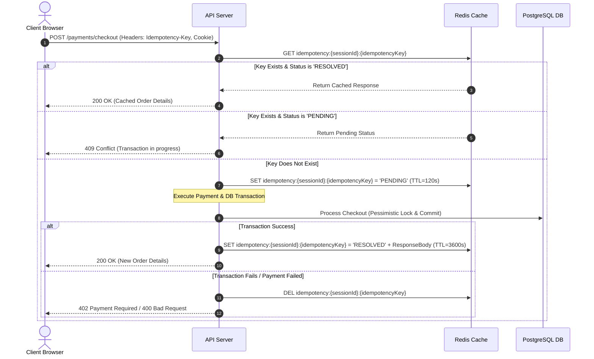

# API Specification: High-Concurrency Ticket Booking System

This document outlines the public and administrative API specifications for the Concert Ticket Booking System. It defines the communication protocols, authentication mechanisms, request/response payloads, validation rules, error codes, and concurrency controls.

---

## 1. Global Configurations

- **Base URL**: `/api/v1`
- **Protocols**: `HTTPS` (REST APIs) and `HTTP/2` (SSE streaming)
- **Content-Type**: `application/json` (for all request and response bodies)
- **Rate Limiting**:
  - Public Endpoints: 60 requests per minute per IP.
  - Reservation Endpoint (`/tickets/reserve`): 5 requests per 10 seconds per session.
  - Payment Endpoint (`/payments/checkout`): 3 requests per minute per session.

---

## 2. Authentication & Session Management

The system enforces security and business limits through two distinct authentication mechanisms:

### 2.1. User Session (Booking Session)

To enforce the **1-ticket-per-user** limit and track active holds without requiring user registration, a stateless, cryptographically signed session token is used.

- **Mechanism**: JWT (JSON Web Token) stored in a secure cookie.
- **Cookie Name**: `session_token`
- **Cookie Attributes**: `HttpOnly; Secure; SameSite=Strict; Max-Age=1800` (30 minutes)
- **JWT Payload**:
  ```json
  {
    "sub": "sess_9f8372b8-1549-4777-a895-32dbf2726438",
    "iat": 1782810000,
    "exp": 1782811800
  }
  ```
- **Lifecycle**:
  - If a client makes a request without a valid `session_token` cookie, the backend automatically generates a new session ID, signs a JWT, and sets the cookie in the response headers.
  - All ticket reservation and payment endpoints require a valid `session_token`.

### 2.2. Admin Authentication

The Admin Dashboard and its corresponding APIs are protected to prevent unauthorized public access.

- **Mechanism**: Bearer Token (JWT).
- **Header**: `Authorization: Bearer <admin_jwt_token>`
- **Token Lifetime**: 2 hours (`Max-Age=7200`)
- **Verification**: Signed using a secret key stored in the server's environment variables.

---

## 3. Idempotency Strategy

To prevent double-charging and double-booking during network retries or accidental double-clicks, the payment checkout endpoint enforces strict idempotency.

### 3.1. The `Idempotency-Key` Header

- The client must generate a unique `UUIDv4` and send it in the `Idempotency-Key` header of the `POST /payments/checkout` request.
- Example: `Idempotency-Key: 9b1deb4d-3b7d-4bad-9bdd-2b0d7b3dcb6d`

### 3.2. Backend Idempotency Flow (Redis-backed)



---

## 4. Error Handling & Standard Error Codes

All API errors return a standard JSON payload adhering to the following structure:

```json
{
  "error_code": "ERROR_CODE_CONSTANT",
  "message": "A user-friendly, readable explanation of what went wrong.",
  "details": {}
}
```

### 4.1. Error Code Registry

| HTTP Status                 | Error Code                | Description                                                                       |
| :-------------------------- | :------------------------ | :-------------------------------------------------------------------------------- |
| `400 Bad Request`           | `INVALID_INPUT`           | The request body failed validation rules (e.g., malformed email, missing fields). |
| `400 Bad Request`           | `ACTIVE_HOLD_EXISTS`      | The session already has an active ticket hold.                                    |
| `400 Bad Request`           | `PURCHASE_LIMIT_EXCEEDED` | The session has already purchased a ticket.                                       |
| `400 Bad Request`           | `INVALID_CATEGORY`        | The requested ticket category is invalid.                                         |
| `401 Unauthorized`          | `SESSION_REQUIRED`        | The session cookie is missing, expired, or tampered with.                         |
| `401 Unauthorized`          | `ADMIN_UNAUTHORIZED`      | The admin token is missing, invalid, or expired.                                  |
| `402 Payment Required`      | `PAYMENT_FAILED`          | The simulated payment transaction failed (e.g., insufficient funds).              |
| `403 Forbidden`             | `SESSION_MISMATCH`        | The ticket being purchased is not held by the current session.                    |
| `409 Conflict`              | `TICKET_UNAVAILABLE`      | The requested ticket category is sold out or all tickets are currently held.      |
| `409 Conflict`              | `DUPLICATE_REQUEST`       | An active transaction is already processing for this idempotency key.             |
| `410 Gone`                  | `RESERVATION_EXPIRED`     | The 5-minute hold has expired, and the ticket has been returned to the pool.      |
| `429 Too Many Requests`     | `RATE_LIMIT_EXCEEDED`     | The client has exceeded the allowed request rate.                                 |
| `500 Internal Server Error` | `INTERNAL_ERROR`          | An unexpected server-side error occurred.                                         |

---

## 5. Public API Endpoints

### 5.1. Initialize Session

Create a new user session explicitly (optional, as middleware will also auto-initialize).

- **HTTP Method**: `POST`
- **Path**: `/sessions`
- **Request Headers**: None
- **Request Body**: None
- **Response**:
  - **Status**: `200 OK`
  - **Headers**:
    - `Set-Cookie: session_token=<JWT>; HttpOnly; Secure; SameSite=Strict; Max-Age=1800`
  - **Response Body**:
    ```json
    {
      "session_id": "sess_9f8372b8-1549-4777-a895-32dbf2726438",
      "expires_at": "2026-06-30T10:38:30Z"
    }
    ```

---

### 5.2. Get Ticket Availability

Retrieve the current counts of available tickets for each category.

- **HTTP Method**: `GET`
- **Path**: `/tickets/availability`
- **Request Headers**: None
- **Request Body**: None
- **Response**:
  - **Status**: `200 OK`
  - **Response Body**:
    ```json
    {
      "event_name": "Summer Symphony 2026",
      "total_capacity": 500,
      "categories": [
        {
          "name": "VIP",
          "price": 100.0,
          "available": 45,
          "total": 100,
          "status": "Available"
        },
        {
          "name": "Standard",
          "price": 50.0,
          "available": 0,
          "total": 400,
          "status": "Sold Out"
        }
      ]
    }
    ```

---

### 5.3. Stream Real-time Availability (SSE)

Establish a persistent connection to receive real-time ticket inventory updates.

- **HTTP Method**: `GET`
- **Path**: `/tickets/availability/stream`
- **Request Headers**:
  - `Accept: text/event-stream`
  - `Cache-Control: no-cache`
  - `Connection: keep-alive`
- **Response**:
  - **Status**: `200 OK`
  - **Headers**:
    - `Content-Type: text/event-stream`
    - `Transfer-Encoding: chunked`
  - **Stream Payloads**:
    - _Immediate Connection Event_:
      ```
      event: initial_state
      data: {"VIP": {"available": 45, "status": "Available"}, "Standard": {"available": 0, "status": "Sold Out"}}

      ```
    - _Inventory Change Event (triggered on hold/release/purchase)_:
      ```
      event: inventory_update
      data: {"category": "VIP", "available": 44, "status": "Available"}

      ```
    - _Sold Out Event (triggered when total capacity is reached)_:
      ```
      event: event_sold_out
      data: {"message": "All tickets for Summer Symphony 2026 are sold out!"}

      ```

---

### 5.4. Reserve Ticket (Create Hold)

Temporarily lock one ticket of a specific category for 5 minutes.

- **HTTP Method**: `POST`
- **Path**: `/tickets/reserve`
- **Request Headers**:
  - `Cookie: session_token=<JWT>` (Required)
- **Request Body**:
  ```json
  {
    "category": "VIP"
  }
  ```
- **Validation Rules**:
  - `category`: Must be a string. Must be exactly `VIP` or `Standard`.
- **Response (Success)**:
  - **Status**: `201 Created`
  - **Response Body**:
    ```json
    {
      "ticket_id": 105,
      "ticket_code": "TKT-VIP-8F2A9D3C",
      "category": "VIP",
      "price": 100.0,
      "status": "Holding",
      "held_at": "2026-06-30T17:08:30Z",
      "expires_at": "2026-06-30T17:13:30Z",
      "seconds_remaining": 300
    }
    ```
- **Response (Errors)**:
  - **Status**: `400 Bad Request` (Active hold already exists)
    ```json
    {
      "error_code": "ACTIVE_HOLD_EXISTS",
      "message": "You already have an active reservation. Please complete your purchase or wait for it to expire.",
      "details": {
        "expires_at": "2026-06-30T17:13:30Z",
        "seconds_remaining": 240
      }
    }
    ```
  - **Status**: `400 Bad Request` (Purchase limit exceeded)
    ```json
    {
      "error_code": "PURCHASE_LIMIT_EXCEEDED",
      "message": "You have already purchased a ticket. Limit is 1 ticket per customer.",
      "details": {}
    }
    ```
  - **Status**: `409 Conflict` (Category sold out / fully held)
    ```json
    {
      "error_code": "TICKET_UNAVAILABLE",
      "message": "Sorry, all tickets in this category are currently reserved or sold. Please check back soon.",
      "details": {}
    }
    ```

---

### 5.5. Get Active Hold

Retrieve details of the current active hold associated with the session (used on page refresh).

- **HTTP Method**: `GET`
- **Path**: `/tickets/hold`
- **Request Headers**:
  - `Cookie: session_token=<JWT>` (Required)
- **Request Body**: None
- **Response (Success)**:
  - **Status**: `200 OK`
  - **Response Body**:
    ```json
    {
      "ticket_id": 105,
      "ticket_code": "TKT-VIP-8F2A9D3C",
      "category": "VIP",
      "price": 100.0,
      "status": "Holding",
      "held_at": "2026-06-30T17:08:30Z",
      "expires_at": "2026-06-30T17:13:30Z",
      "seconds_remaining": 145
    }
    ```
- **Response (No Hold)**:
  - **Status**: `404 Not Found`
  - **Response Body**:
    ```json
    {
      "error_code": "NO_ACTIVE_HOLD",
      "message": "No active reservation was found for this session.",
      "details": {}
    }
    ```

---

### 5.6. Cancel Hold

Manually release the active hold, returning the ticket to the available pool immediately.

- **HTTP Method**: `POST`
- **Path**: `/tickets/hold/cancel`
- **Request Headers**:
  - `Cookie: session_token=<JWT>` (Required)
- **Request Body**: None
- **Response**:
  - **Status**: `200 OK`
  - **Response Body**:
    ```json
    {
      "success": true,
      "data": {
        "message": "Reservation cancelled successfully"
      }
    }
    ```

---

### 5.7. Payment Checkout

Submit payment details to finalize the ticket purchase.

- **HTTP Method**: `POST`
- **Path**: `/payments/checkout`
- **Request Headers**:
  - `Cookie: session_token=<JWT>` (Required)
  - `Idempotency-Key: <UUIDv4>` (Required)
- **Request Body**:
  ```json
  {
    "ticket_id": 105,
    "email": "buyer@example.com",
    "card_holder_name": "John Doe",
    "payment_method": "simulated",
    "simulate_status": "success"
  }
  ```
- **Validation Rules**:
  - `ticket_id`: Must be a positive integer.
  - `email`: Must be a valid email format. Max length 255.
  - `card_holder_name`: Must be a non-empty string. Max length 100.
  - `payment_method`: Must be exactly `simulated`.
  - `simulate_status`: Must be either `success` or `fail` (to allow mock testing).
- **Response (Success)**:
  - **Status**: `200 OK`
  - **Response Body**:
    ```json
    {
      "success": true,
      "data": {
        "order_id": "d3b07384-d113-4ec5-a5d7-0a1f1a23c345",
        "ticket_id": 105,
        "amount": 100.0,
        "payment_reference": "PAY-d3b07384-d113-4ec5-a5d7-0a1f1a23c345",
        "paid_at": "2026-06-30T17:10:12Z"
      }
    }
    ```
- **Response (Errors)**:
  - **Status**: `403 Forbidden` (Session mismatch)
    ```json
    {
      "error_code": "SESSION_MISMATCH",
      "message": "This ticket is not held by your active session.",
      "details": {}
    }
    ```
  - **Status**: `410 Gone` (Hold expired)
    ```json
    {
      "error_code": "RESERVATION_EXPIRED",
      "message": "Your reservation window has expired, and the ticket has been released.",
      "details": {}
    }
    ```
  - **Status**: `402 Payment Required` (Payment Failure)
    ```json
    {
      "error_code": "PAYMENT_FAILED",
      "message": "Payment failed: Insufficient funds. Please try again with another card.",
      "details": {}
    }
    ```

---

## 6. Admin API Endpoints

All admin endpoints require the `Authorization` header containing the admin token.

### 6.1. Admin Login

Authenticate using the admin passcode and receive a JWT token.

- **HTTP Method**: `POST`
- **Path**: `/admin/login`
- **Request Headers**: None
- **Request Body**:
  ```json
  {
    "passcode": "admin123"
  }
  ```
- **Validation Rules**:
  - `passcode`: Must be a non-empty string.
- **Response (Success)**:
  - **Status**: `200 OK`
  - **Response Body**:
    ```json
    {
      "token": "eyJhbGciOiJIUzI1NiIsInR5cCI6IkpXVCJ9...",
      "expires_at": "2026-06-30T19:08:30Z"
    }
    ```
- **Response (Error)**:
  - **Status**: `401 Unauthorized`
  - **Response Body**:
    ```json
    {
      "error_code": "ADMIN_UNAUTHORIZED",
      "message": "Invalid admin passcode.",
      "details": {}
    }
    ```

---

### 6.2. Get Sales and Revenue Metrics

Retrieve real-time metrics for the admin dashboard.

- **HTTP Method**: `GET`
- **Path**: `/admin/metrics`
- **Request Headers**:
  - `Authorization: Bearer <admin_token>` (Required)
- **Request Body**: None
- **Response**:
  - **Status**: `200 OK`
  - **Response Body**:
    ```json
    {
      "total_tickets_sold": 120,
      "total_revenue": 8500.0,
      "remaining_inventory": {
        "VIP": 45,
        "Standard": 335
      },
      "held_inventory": {
        "VIP": 10,
        "Standard": 15
      },
      "available_inventory": {
        "VIP": 45,
        "Standard": 50
      }
    }
    ```

---

### 6.3. Get Live Lock Monitor

Retrieve a list of all tickets currently in the `Holding` state along with remaining hold times.

- **HTTP Method**: `GET`
- **Path**: `/admin/holds`
- **Request Headers**:
  - `Authorization: Bearer <admin_token>` (Required)
- **Request Body**: None
- **Response**:
  - **Status**: `200 OK`
  - **Response Body**:
    ```json
    [
      {
        "ticket_id": 105,
        "ticket_code": "TKT-VIP-8F2A9D3C",
        "category": "VIP",
        "session_id": "sess_9f8372b8-1549-4777-a895-32dbf2726438",
        "held_at": "2026-06-30T17:08:30Z",
        "expires_at": "2026-06-30T17:13:30Z",
        "seconds_remaining": 145
      },
      {
        "ticket_id": 242,
        "ticket_code": "TKT-STD-4D2F8A1C",
        "category": "Standard",
        "session_id": "sess_0a1f1a23-d3b0-4ec5-a5d7-7b7d4bad9bdd",
        "held_at": "2026-06-30T17:09:12Z",
        "expires_at": "2026-06-30T17:14:12Z",
        "seconds_remaining": 187
      }
    ]
    ```
