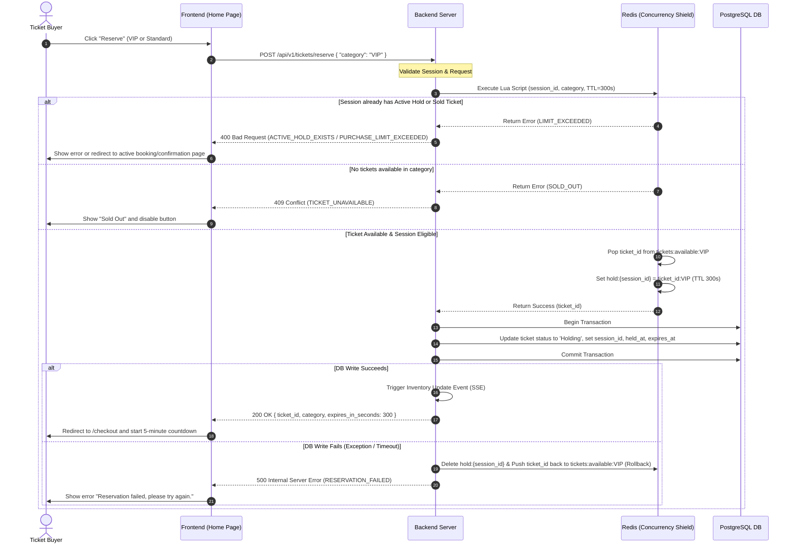

# Feature: Atomic Ticket Reservation (Holding)

This feature handles the temporary, exclusive locking of a ticket for a user session. It guarantees that tickets are reserved on a first-come, first-served basis, preventing overselling or double-booking even under extreme concurrent spikes, while enforcing the business rule of a single active hold or purchase per session.

---

## 1. Goal

To execute an atomic "check-and-hold" operation that reserves exactly one ticket of the requested category for 5 minutes (300 seconds), binds it securely to the user's session, persists the hold in the database, and prevents any concurrent reservation requests from acquiring the same ticket.

---

## 2. User Story

**As a** Ticket Buyer  
**I want to** select a ticket category and click "Reserve"  
**So that** the system temporarily locks a ticket for me and prevents anyone else from booking it while I fill out the payment details.

---

## 3. Business Flow

1. **Initiation**: The user clicks the "Reserve" button for a specific ticket category on the Home Page.
2. **Request Submission**: The frontend sends a `POST /api/v1/tickets/reserve` request containing the ticket category (`VIP` or `Standard`) and the session token.
3. **Validation**: The backend performs initial validation on the session token and ticket category.
4. **Atomic Concurrency Check (Redis)**: The backend executes a Redis Lua script to perform the check-and-hold operation atomically:
   - It checks if the session already has an active hold or completed purchase.
   - It checks if there is an available ticket in the requested category's Redis set.
   - If available and the session is eligible, it pops a ticket ID, sets the session hold key (`hold:{session_id}`) with a 300-second TTL, and returns success.
5. **Database Persistence**: Upon receiving success from Redis, the backend starts a database transaction to update the ticket status in PostgreSQL to `Holding`, associating it with the `session_id`, `held_at` timestamp, and `expires_at` timestamp.
6. **Error Rollback**: If the database update fails (e.g., database timeout), the backend rolls back the Redis state by deleting the hold key and returning the ticket ID to the available pool.
7. **Success Response & Redirection**: If database persistence succeeds, the backend triggers an inventory update event (SSE) and returns a `200 OK` response. The frontend redirects the user to the Booking/Checkout Page, displaying a synchronized 5-minute countdown.

---

## 4. Acceptance Criteria

- **AC 1**: A successful reservation must immediately decrease the available inventory count for the selected category by 1.
- **AC 2**: A successful reservation must redirect the user to the Booking/Checkout Page with a countdown timer set to 5 minutes (300 seconds).
- **AC 3**: A user session can hold at most **1 ticket** at any time. If a session already has an active hold, any new reservation attempt must be rejected.
- **AC 4**: A user session can purchase at most **1 ticket** in total. If a session already has a ticket in the `Sold` state, any reservation attempt must be rejected.
- **AC 5**: Under high concurrency (e.g., 100 users attempting to reserve the last remaining ticket), exactly 1 user must succeed, and the remaining 99 must fail gracefully, remaining on the home page with a "Sold Out" notification.
- **AC 6**: The hold duration is exactly 300 seconds. The countdown timer on the frontend must remain synchronized with the server's remaining duration upon page refresh.

---

## 5. Edge Cases

- **EC-1: Concurrent Reservation Spikes on the Last Ticket**
  - _Scenario_: 100 users click "Reserve" at the exact same millisecond when only 1 ticket remains.
  - _Mitigation_: The Redis Lua script executes atomically and sequentially on a single thread. The first request processed will pop the ticket ID and establish the hold. The subsequent 99 requests will find the set empty and will be rejected immediately with a `409 Conflict`.
- **EC-2: Redis-PostgreSQL Out of Sync**
  - _Scenario_: The Redis Lua script successfully reserves a ticket, but the subsequent PostgreSQL database write fails or times out.
  - _Mitigation_: The backend must catch any database exception, immediately execute a rollback command in Redis (deleting `hold:{session_id}` and pushing the ticket ID back into the `tickets:available:{category}` set), and return a `500 Internal Server Error` to the client.
- **EC-3: Double-Clicking the Reserve Button**
  - _Scenario_: A user rapidly double-clicks the "Reserve" button.
  - _Mitigation_: The frontend disables the button immediately after the first click. Additionally, the backend's Redis Lua script will reject the second request because the session will already have an active hold key (`hold:{session_id}`) created by the first request.

---

## 6. Validation Rules

- **VR-1: Session Token Validation**
  - The request must include a `session_token` in the headers.
  - The token must be non-empty and conform to the UUIDv4 format. If invalid, return `400 Bad Request` with error code `INVALID_SESSION_TOKEN`.
- **VR-2: Ticket Category Validation**
  - The request body must contain a `category` field.
  - The value of `category` must be exactly `VIP` or `Standard` (case-sensitive). If invalid, return `400 Bad Request` with error code `INVALID_TICKET_CATEGORY`.
- **VR-3: Session State Validation**
  - The backend must query the database or Redis to ensure the session does not have:
    - A ticket in the `Holding` state (return `400 Bad Request` with error code `ACTIVE_HOLD_EXISTS`).
    - A ticket in the `Sold` state (return `400 Bad Request` with error code `PURCHASE_LIMIT_EXCEEDED`).
- **VR-4: Inventory Availability Validation**
  - The requested category must have an available ticket count $> 0$. If the count is 0, return `409 Conflict` with error code `TICKET_UNAVAILABLE`.
