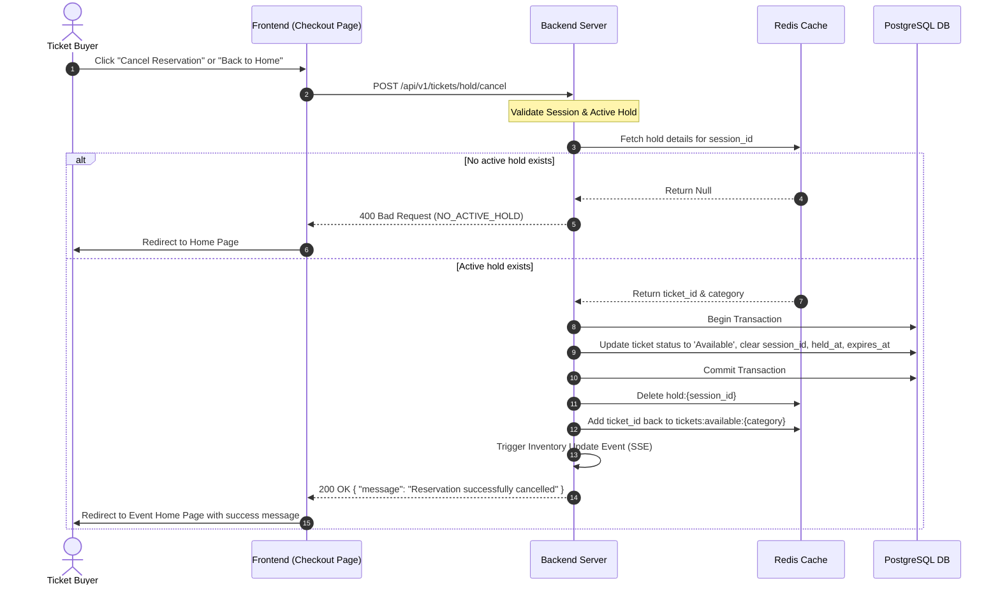

# Feature: Manual Reservation Cancellation

This feature allows a user with an active ticket hold to explicitly cancel their reservation before the 5-minute timeout. Canceling the reservation immediately releases the ticket back to the available inventory pool, allowing other users to reserve and purchase it.

---

## 1. Goal

To securely release a temporarily held ticket associated with a user's session, removing the lock in Redis, updating the ticket's state to `Available` in the PostgreSQL database, incrementing the available inventory count, and broadcasting the updated counts to all connected clients in real-time.

---

## 2. User Story

**As a** Ticket Buyer  
**I want to** manually cancel my ticket reservation on the Booking/Checkout Page  
**So that** I can free up the ticket for other buyers and return to the Event Home Page to select a different category if I change my mind.

---

## 3. Business Flow

1. **Cancellation Trigger**: The user clicks the "Cancel Reservation" or "Back to Home" button on the Booking/Checkout Page.
2. **Request Submission**: The frontend sends a `POST /api/v1/tickets/hold/cancel` request with the session token in the headers.
3. **Hold Verification**: The backend checks Redis or the database to verify if the session has an active hold.
4. **Database State Release**: The backend starts a database transaction to update the ticket's state in PostgreSQL:
   - Sets `status` to `Available`.
   - Clears `session_id`, `held_at`, and `expires_at` (sets them to `NULL`).
   - Commits the transaction.
5. **Redis Inventory Restoration**:
   - The backend deletes the session hold key `hold:{session_id}`.
   - The backend adds the `ticket_id` back to the corresponding category set (`tickets:available:VIP` or `tickets:available:Standard`).
6. **Real-Time Broadcast**: The backend triggers an inventory update event, broadcasting the incremented count to all active SSE clients.
7. **Redirection**: The backend returns a `200 OK` response. The frontend redirects the user back to the Event Home Page with an inline notification confirming the cancellation.

---

## 4. Acceptance Criteria

- **AC 1**: Clicking the cancellation button must immediately release the held ticket, returning it to the available pool.
- **AC 2**: The available inventory count for the canceled category must increase by exactly 1.
- **AC 3**: The user's active hold must be cleared from the session, allowing them to initiate a new reservation immediately.
- **AC 4**: The real-time inventory count update must be pushed to all connected clients via SSE within 2 seconds of the cancellation.
- **AC 5**: If the cancellation request is received after the hold has already expired (and potentially been reclaimed or reserved by another user), the server must handle it gracefully, clearing any stale client state and redirecting them to the home page.
- **AC 6**: A user cannot cancel a ticket that has already been purchased (`Sold` state).

---

## 5. Edge Cases

- **EC-1: Cancellation of an Expired Hold**
  - _Scenario_: A user clicks "Cancel Reservation" at `05:02` (2 minutes after expiration). The background reclamation job has already released the ticket, and potentially another user has reserved it.
  - _Mitigation_: The server checks the session's active hold. Since the hold is expired and no longer associated with the session, the server returns a `400 Bad Request` or `404 Not Found` with the error code `NO_ACTIVE_HOLD`. The frontend handles this by clearing local state and redirecting the user to the Event Home Page.
- **EC-2: Cancellation of a Sold Ticket**
  - _Scenario_: A user tries to bypass the UI and send a cancel request for a ticket they have already successfully paid for.
  - _Mitigation_: The backend must check the ticket's state in the database. If the ticket is in the `Sold` state, the cancellation request must be rejected with a `400 Bad Request` or `403 Forbidden` error. Once a ticket is sold, it is a permanent transaction and cannot be canceled via the temporary hold release endpoint.
- **EC-3: Concurrent Cancellation and Background Reclamation**
  - _Scenario_: The user clicks cancel at the exact millisecond the 5-minute timer expires, causing both the manual cancellation request and the background reclamation job to execute simultaneously.
  - _Mitigation_: Database transactions and Redis atomic commands must be used. Whichever process acquires the lock/starts the transaction first will transition the ticket from `Holding` to `Available` and increment the inventory. The second process will see that the ticket is no longer in the `Holding` state (or no longer associated with the session) and will exit gracefully without double-incrementing the inventory counts.

---

## 6. Validation Rules

- **VR-1: Session Token Validation**
  - The request must include a `session_token` in the headers.
  - The token must be non-empty and conform to the UUIDv4 format. If invalid, return `400 Bad Request` with error code `INVALID_SESSION_TOKEN`.
- **VR-2: Active Hold Ownership**
  - The session must own a ticket currently in the `Holding` state.
  - If the session does not have any active hold, the server must return `400 Bad Request` with error code `NO_ACTIVE_HOLD`.
- **VR-3: State Transition Validation**
  - The ticket being canceled must be in the `Holding` state. If the ticket is in the `Sold` state, return `400 Bad Request` with error code `CANNOT_CANCEL_SOLD_TICKET`. If the ticket is already in the `Available` state, return `200 OK` (idempotent success) or `400 Bad Request` depending on whether it belongs to the session.
