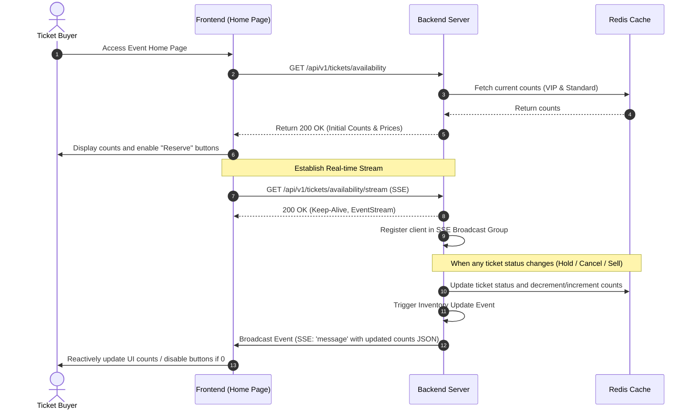

# Feature: Real-Time Ticket Availability (Streaming)

This feature enables clients to retrieve the initial ticket counts and receive real-time, low-latency updates on ticket availability for all categories (`VIP` and `Standard`) on the Event Home Page. This ensures that users always see the correct available ticket counts and are prevented from attempting to reserve sold-out categories.

---

## 1. Goal

To provide a real-time, low-latency display of available ticket counts per category, preventing unnecessary reservation attempts for sold-out tickets, and giving users immediate visual feedback on ticket availability and overall event sales status.

---

## 2. User Story

**As a** Ticket Buyer  
**I want to** view the exact number of remaining tickets for each category in real-time on the Event Home Page  
**So that** I can see if tickets are still available before initiating a booking, without having to manually refresh the page.

---

## 3. Business Flow

1. **Accessing the Page**: The user navigates to the Event Home Page.
2. **Initial Fetch**: The frontend sends a `GET /api/v1/tickets/availability` request to retrieve the current available ticket counts and prices for each category.
3. **Establishing Stream**: The frontend establishes a persistent Server-Sent Events (SSE) connection to the backend via `GET /api/v1/tickets/availability/stream`.
4. **Broadcast Registration**: The backend registers the client's connection in an active in-memory broadcast group.
5. **Real-Time Update Trigger**: Whenever a ticket state change occurs (a ticket is reserved, a hold is canceled/expired, or a ticket is sold), the backend triggers an inventory update.
6. **Broadcasting**: The backend broadcasts the updated inventory counts (`VIP` and `Standard` counts) to all active SSE connections.
7. **Reactive UI Update**: The frontend receives the event and reactively updates the remaining counts, disables the "Reserve" button if a category is sold out, or displays a global "Sold Out" banner if the total inventory reaches 0.

---

## 4. Acceptance Criteria

- **AC 1**: The Event Home Page must display the `VIP` and `Standard` ticket categories along with their respective prices ($100 and $50).
- **AC 2**: The page must display the remaining count of available tickets for each category, starting at 100 for `VIP` and 400 for `Standard`.
- **AC 3**: The remaining ticket counts must update in real-time (within 2 seconds of a backend state change) without requiring a manual page refresh.
- **AC 4**: If a category's available inventory reaches 0, the "Reserve" button for that category must be immediately disabled and its text changed to "Sold Out".
- **AC 5**: If the total inventory (500 tickets) is sold out, a prominent "Sold Out" banner must be displayed on the home page, and all reservation buttons must be disabled.
- **AC 6**: The real-time stream must be highly efficient, utilizing an event-driven broadcast model rather than querying the database per connected client.

---

## 5. Edge Cases

- **EC-1: SSE Connection Drop & Recovery**
  - _Scenario_: A user's network connection drops momentarily, causing the SSE connection to close.
  - _Mitigation_: The frontend must implement an automatic reconnection strategy with exponential backoff. Upon successful reconnection, the frontend must perform a full fetch via `GET /api/v1/tickets/availability` to synchronize its state, ensuring no intermediate updates were missed.
- **EC-2: High-Concurrency Broadcast Storm**
  - _Scenario_: Under peak load (5,000 concurrent users), ticket statuses change rapidly (multiple times per second), creating excessive network broadcast overhead.
  - _Mitigation_: The backend must throttle/debounce the SSE broadcasts. Instead of broadcasting on every single ticket state change, it should batch updates and broadcast them at a maximum frequency of once every 500ms.
- **EC-3: Inactive Browser Tab**
  - _Scenario_: A user leaves the Event Home Page open in a background tab for an extended period, consuming server resources.
  - _Mitigation_: The frontend should monitor tab visibility using the Page Visibility API. If the tab remains in the background for more than 3 minutes, the SSE connection is closed. The connection is re-established immediately when the user returns to the tab.

---

## 6. Validation Rules

- **VR-1: Endpoint Access**
  - Both the availability REST endpoint and the SSE stream endpoint are public and do not require authentication.
  - To prevent abuse and denial-of-service, both endpoints must be rate-limited (e.g., maximum 60 requests per minute per IP for the REST endpoint, and strict limits on concurrent SSE connections per IP).
- **VR-2: SSE Connection Request**
  - The SSE connection request must include a valid session token (anonymous session) in the query parameters or headers. If the session token is missing or malformed, the server must reject the connection with a `400 Bad Request`.
